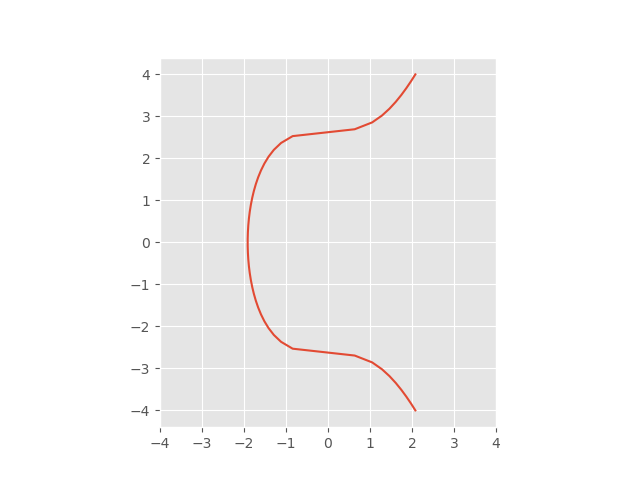

<div style="border:1px solid powerblue;width:100vw;heigth:100px;display:flex;background:white">
    
    <h1 style="color:#f00">HUNTER BIANCHI</h1>
</div>          

Public Key: 

Plataform Address: [https://triade-group.vercel.app/]()

___

## Who is/are Hunter Bianchi?

Hunter Bianchi is/are a non-singular person who fight for freedom using [distribution of information](#what-is-distribution-of-information).</br>

So I may be "We" and We may be "I".</br>

We are "We" when the movement We are within is made by a group.</br>

I am "I" when the movement I am within is made by myself.</br>

Hunter Bianchi is an Egregore focused on make Nations **Free**.

___


## What is Distribution of Information?

</br>

Distribution of information is the last level before the freedom.</br>
No nation can oppress your citizens if they own [information](#what-kind-of-information-i-distribute) .

___

## What kind of information I distribute?

</br>

All of information needed to make an individual exist free. That information are organized under a [Blockchain](#what-kind-of-blockchain-we-use) system

___

## What kind of Blockchain We use?

</br>
Our Blockchain starts to be public in 2022.

Before that, we will explain to you our logic and consent.

Our Blockchain's logic is simple: We create individual using [Elliptic Curves](#what-is-an-elliptic-curve) to define a [pair of keys](#what-kind-of-key-pair-we-use) to the individual become an [actor](#what-is-an-actor) of this Blockchain

___

## What kind of Key Pair We use?

</br>

___

## What is an **Actor**?

</br>
Actor is anyone who help the Blockchain works.</br>

We have 4 kind of Actors:

users
miners
fullnodes
developers

___

## What is an Elliptic Curve?

</br>
TRÍADE uses the Elliptic Curve Digital Signature Algorithm (ECDSA) based on elliptic curve cryptography. The particular elliptic curve is known as secp256k1, which is the curve

y² = x³ + 7

over a [finite field](#finite-fields) (a.k.a. Galois field) to be described shortly.

</br>

Addition on elliptic curves in the plane is defined geometrically in terms of where lines intercept the curve. We won’t go into the geometry here, except to say that it boils down to a set of equations involving real numbers. But we’re not working over real numbers; we’re working over a finite field.
Finite field modulus

The idea is to take the equations motivated by the geometry in the plane then use those equations to define addition when you’re not working over real numbers but over a different field. In the case of secp256k1, the field is the finite field of integers mod p where

p = 2256 – 232 – 977

Here p was chosen to be relatively close to 2256. It’s not the largest prime less than 2256; there are a lot of primes between p and 2256. Other factors also went into the choice p. Note that we’re not working in the integers mod p per se; we’re working in an Abelian group whose addition law is defined by an elliptic curve over the integers mod p.

(Update: Here’s another post about secp256k1’s sister curve, secp256r1, another curve modulo a 256-bit prime, but with different structure.)
Base point

Next, we pick a base point g on the elliptic curve. The standard defining secp256k1 says that g is

0279BE667EF9DCBBAC55A06295CE870B07029BFCDB2DCE28D959F2815B16F81798

in “compressed form” or

040x79BE667EF9DCBBAC55A06295CE870B07029BFCDB2DCE28D959F2815B16F81798483ADA7726A3C4655DA4FBFC0E1108A8FD17B448A68554199C47D08FFB10D4B8

in “uncompressed form”.

The base point is a specially chosen point on the elliptic curve, and so it is a pair of numbers mod p, not a single number. How do you extract x and y from these compressed or uncompressed forms?
Compressed form

The compressed form only gives x and you’re supposed to solve for y. The uncompressed form gives you x and y. However, the numbers are slightly encoded. In compressed form, the string either starts with “o2” or “o3” and the rest of the string is the hexadecimal representation of x. There will be two values of y satisfying

y² = x³ + 7 mod p

and the “o2” or “03” tells you which one to pick. If the compressed form starts with 02, pick the root whose least significant bit is even. And if the compressed form starts with 03, pick the root whose least significant bit is odd. (The two roots will add to p, and p is odd, so one of the roots will be even and one will be odd.)
Uncompressed form

The uncompressed form will always start with 04. After this follow the hexadecimal representations of x and y concatenated together.

In either case we have

x = 79BE667EF9DCBBAC55A06295CE870B07029BFCDB2DCE28D959F2815B16F81798

and

y = 483ADA7726A3C4655DA4FBFC0E1108A8FD17B448A68554199C47D08FFB10D4B8

We can verify this with a little Python code:

```python
    x = 0x79BE667EF9DCBBAC55A06295CE870B07029BFCDB2DCE28D959F2815B16F81798
    y = 0x483ADA7726A3C4655DA4FBFC0E1108A8FD17B448A68554199C47D08FFB10D4B8
    p = 0xFFFFFFFFFFFFFFFFFFFFFFFFFFFFFFFFFFFFFFFFFFFFFFFFFFFFFFFEFFFFFC2F
    assert((y*y - x*x*x - 7) % p == 0)
```

Exponentiation over elliptic curve

Starting with our base point g, define kg to be g added to itself k times. Note again that the sense of “addition” here is addition in the elliptic curve, not addition in the field of integers mod p. The key to elliptic curve cryptography is that kg can be computed efficiently, but solving for k starting from the product kg cannot. You can compute kg using the fast exponentiation algorithm, but solving for k requires computing discrete logarithms. (This is the ECDLP: Elliptic Curve Discrete Logarithm Problem.)

Why is this called “exponentiation” and not “multiplication”? Arithmetic on the elliptic curve is commutative, and in commutative (i.e. Abelian) groups the group operation is usually denoted as addition. And repeated addition is called multiplication.

But in general group theory, the group operation is denoted as multiplication, and repeated application of the group operation is called  exponentiation. It’s conventional to use the general term “exponentiation” even though over an Abelian group it makes more sense to call it multiplication.

You undo exponentiation by taking logarithms, so the process of solving for k is called the discrete logarithm problem. The security of elliptic curve cryptography depends on the difficulty of computing discrete logarithms.
Counting bits of security

The best algorithms for solving discrete logarithm problem in a group of size n currently require O(√n) operations. How big is n in our case?

The base point g was chosen to have a large order, and in fact its order is approximately 2256.  Specifically, the order of g written in hexadecimal is

n = FFFFFFFFFFFFFFFFFFFFFFFFFFFFFFFEBAAEDCE6AF48A03BBFD25E8CD0364141.

This means that we get approximately 256/2 = 128 bits of security because √(2256) = 2128.


**References:**

| Name: | Link: |
| :--------------------: | :-----------------------: |
| John D. Cook| https://www.johndcook.com/blog/2018/08/14/bitcoin-elliptic-curves/ |</br>


___
</br>

## Finite Fields

</br>
A field is an algebraic structure that lets you do everything you’re used to from basic math: you can add and multiply elements, and addition and multiplication have the usual properties you’d expect. More formally, the elements of a field form an Abelian (commutative) group with respect to addition, the non-zero elements form an Abelian group with respect to multiplication, and multiplication distributes over addition.

The rational numbers are a field. So are the real numbers and complex numbers. But it may be surprising that there are finite fields. If p is a prime, then the integers mod p form a field. For example, the integers mod 7 are the numbers 0 through 6 with addition and multiplication defined as usual, except you take the remainder by 7.

All finite fields have pn elements where p is prime and n is an integer at least 1. Conversely, for every number of the form pn there is a field that size. Furthermore, all groups of a given size are isomorphic. The field with pn elements is sometimes called the Galois field with that many elements, written GF(pn).

The Galois fields of order GF(p) are simply the integers mod p. For n > 1, the elements of GF(pn) are polynomials of degree n-1 with coefficients coming from GF(p). You add polynomials as you’d expect, but multiplication is a little different. You pick an irreducible polynomial g(x) of degree n and define multiplication in GF(pn) to be the ordinary polynomial product except you take the remainder after dividing by g(x). If you chose a different irreducible polynomial g(x) you’ll get a different definition of multiplication and hence a different field, but all such fields will be isomorphic.

Finite fields arise in applications, such as coding theory. Reed -Solomon codes, for example, are defined in terms of finite fields. Finite fields also arise in cryptography, for example in elliptic curves over finite fields. In many applications, p = 2.

Finite fields cannot be algebraically complete. In that sense you can’t have a finite analog of the complex numbers.
Example

Let’s look at GF(23), the field with 8 elements, i.e. 3-bit numbers. We choose g(x) = x³ + x + 1 as our irreducible polynomial.

The number 3 (11two) corresponds to the polynomial x + 1. The number 5 (101two) corresponds to x² + 1. The sum of 3 and 5 in this field corresponds to x² + x, which correspond to 6. (The constant terms cancel out because 1 + 1 = 0 mod 2.)

To compute the product of 5 and 6 in this field, we multiply (x² + 1)(x² + x). When we divide by x³ + x + 1, working mod 2, we get a remainder of x + 1, which corresponds to 3. So in this field, 5 times 6 equals 3.

**References:**

| Name: | Link: |
| :--------------------: | :-----------------------: |
| John D. Cook| https://www.johndcook.com/blog/finite-fields/ |

___
</br>

Our song:

Join us now and share the software;</br>
You'll be free, hackers, you'll be free.</br>
Join us now and share the software;</br>
You'll be free, hackers, you'll be free.</br>

Hoarders can get piles of money,</br>
That is true, hackers, that is true.</br>
But they cannot help their neighbors;</br>
That's not good, hackers, that's not good.</br>

When we have enough free software</br>
At our call, hackers, at our call,</br>
We'll kick out those dirty licenses</br>
Ever more, hackers, ever more.</br>

Join us now and share the software;</br>
You'll be free, hackers, you'll be free.</br>
Join us now and share the software;</br>
You'll be free, hackers, you'll be free.</br>


<!--
**hunterbianchi/hunterbianchi** is a ✨ _special_ ✨ repository because its `README.md` (this file) appears on your GitHub profile.

Here are some ideas to get you started:

- 🔭 I’m currently working on ...
- 🌱 I’m currently learning ...
- 👯 I’m looking to collaborate on ...
- 🤔 I’m looking for help with ...
- 💬 Ask me about ...
- 📫 How to reach me: ...
- 😄 Pronouns: ...
- ⚡ Fun fact: ...
-->
